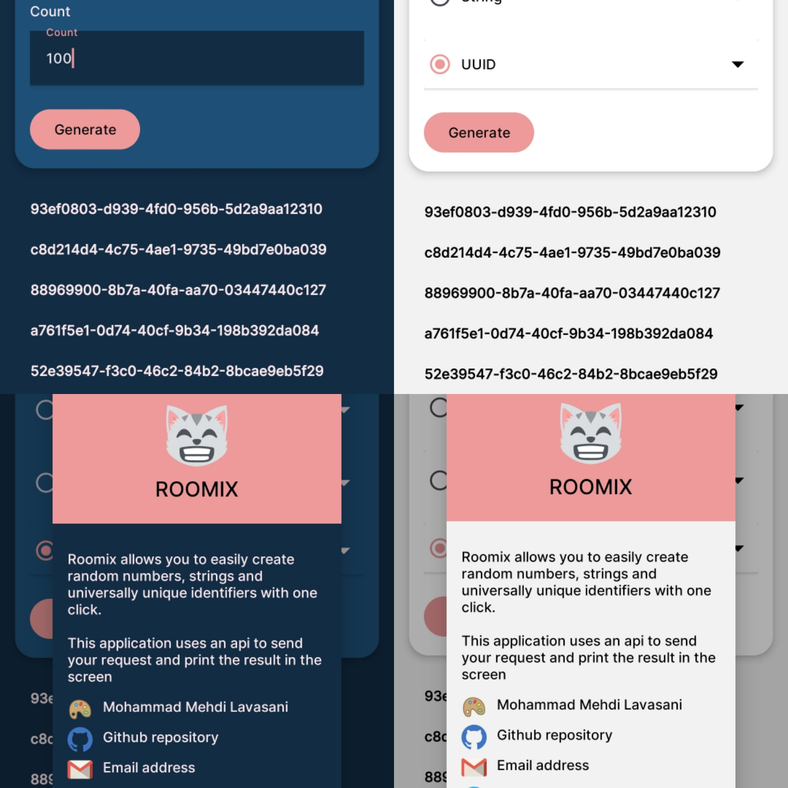

    
    <h1>ROOMIX</h1>

     
    

    Roomix allows you to easily create random numbers, strings and universally unique identifiers with one click.\n\nThis application uses an api to send your request and print the result in the screen.
    

## Features

- Generate random numbers
- Generate random strings
- Generate random UUIDs
- Copy items to clipboard
- Save items in file.

## Screenshots

## Authors

- [@zenDEv](https://github.com/mehdiprgm)

## 🛠 Skills
Android, Kotlin, Java, Linux, Gamer

